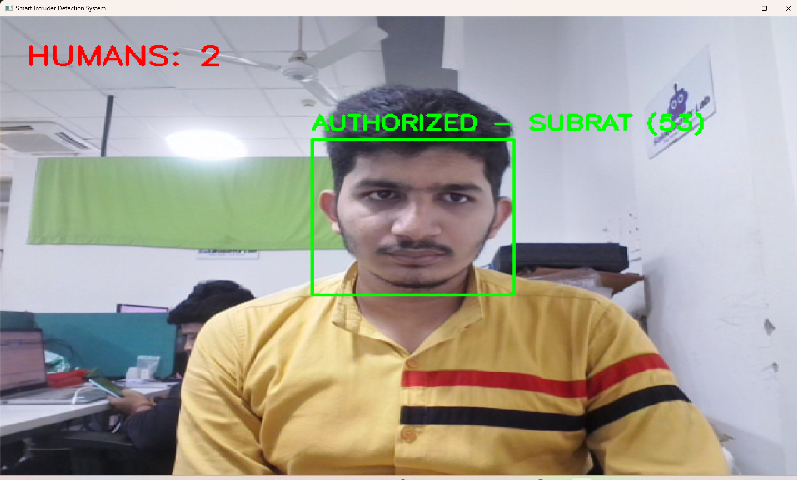

# 🔍 AI-Based Smart Intruder Detection & Real-Time Alert System using Computer Vision


## 📌 Overview

An AI-powered real-time surveillance system built using Python, OpenCV, YOLOv8, and LBPH face recognition for intelligent intruder monitoring.

This system performs real-time human detection, face recognition, and automated intruder alerting through a webcam-based surveillance pipeline.

It first detects humans using YOLOv8, then performs face detection and recognition to identify authorized users. If an unknown or unauthorized person is detected, the system automatically captures evidence, triggers alerts, sends Telegram notifications, and logs the event.

Designed for practical smart surveillance applications with real-time monitoring, alert automation, and evidence management.

---

## ⚡ Core Functionalities

If an intruder is detected, the system automatically:

- Captures and stores the intruder image
  
- Triggers a local alarm notification
  
- Sends instant Telegram alert with captured image
  
- Adds timestamp information
  
- Logs event details into CSV file
  
- Prevents repeated alerts using cooldown protection

---

## ⭐ Key Highlights

- Real-time human detection using YOLOv8
  
- Face detection using Haar Cascade
  
- Face recognition using LBPH algorithm
  
- Authorized user identification
  
- Unknown intruder classification
  
- Confidence averaging for stable recognition
  
- Telegram alert integration
  
- Intruder image evidence storage
  
- CSV event logging
  
- Alert cooldown mechanism

- Clean surveillance monitoring UI
  
- Human count display in live feed

---

## 🚀 Features

- Detects humans in real-time via webcam
  
- Detects faces inside detected human regions
  
- Recognizes authorized users
  
- Identifies intruders automatically

- Captures intruder images for evidence
  
- Sends Telegram alerts with image and timestamp
  
- Triggers local beep alarm
  
- Maintains CSV event logging
  
- Uses confidence averaging for stable predictions
  
- Prevents alert spamming using cooldown logic
  
- Displays live human count
  
- Displays recognition status in real time

---

## 🧠 Technologies Used

- Python
  
- OpenCV
  
- YOLOv8 (Ultralytics)
  
- Haar Cascade
  
- LBPH Face Recognition
  
- NumPy
  
- Telegram Bot API
  
- CSV Logging
  
- Pickle
  
- Winsound

---

## 🧩 System Architecture

```text
Webcam Input

      ↓

YOLOv8 Human Detection

      ↓

Face Detection (Haar Cascade)

      ↓

Face Recognition (LBPH)

      ↓

Decision Engine
```

### Authorized User Flow

```text
Authorized Person Detected

      ↓

Display AUTHORIZED Status

      ↓

Continue Monitoring
```

### Intruder Flow

```text
Intruder Detected

      ↓

Capture Image

      ↓

Trigger Alarm

      ↓

Send Telegram Alert

      ↓

Save CSV Log

      ↓

Store Evidence
```

---

## 🔄 How It Works

### Step 1: Live Video Capture

The webcam continuously captures live video frames.

### Step 2: Human Detection

YOLOv8 detects human presence in real time.

### Step 3: Face Detection

Face detection is performed only inside detected human regions.

### Step 4: Face Recognition

Detected faces are compared with trained authorized user data using LBPH recognizer.

### Step 5: Confidence Stabilization

Recognition confidence values are averaged over multiple frames to improve stability and reduce false detections.

### Step 6: Decision Making

System classifies the detected person as:

- Authorized User
  
- Unsure
  
- Intruder

### Step 7: Automated Intruder Response
If an intruder is detected:

- Image is captured
  
- Local alarm is triggered
  
- Telegram alert is sent
  
- Event is logged in CSV
  
- Evidence image is stored

---

## 📷 Output

### ✅ Authorized User Detection

System correctly identifies authorized users.

Real-time authorized user recognition with multi-human detection support.

```python
AUTHORIZED - SUBRAT (55)
```

Image:

```markdown
Image:


!```

---

### 🚨 Intruder Detection

Unknown users are identified as intruders.

Image:

```markdown

```

---

### 📩 Telegram Alert Notification

Real-time Telegram alert with captured evidence image.

Image:

```markdown

```

---

### 📊 CSV Event Logging

All detection events are stored with timestamp and details.

Image:

```markdown

```

---

## 📂 Data Storage

### Intruder Images
Stored in:

```text
intruder_images/
```

### Event Logs
Stored in:

```text
access_log.csv
```

### Trained Model
Stored in:

```text
trainer.yml
```

### Label Mapping
Stored in:

```text
labels.pkl
```

---

## 📁 Project Structure

```text
intruder_detection/
│
├── intr.py

├── trainer.yml

├── labels.pkl

├── access_log.csv

│
├── intruder_images/

│
├── authorized_image.png

├── intruder.png

├── intruder_alert.jpeg

├── CSV_log.png

│

└── dataset/

    └── SUBRAT/
```

---

## 📦 Requirements

Hardware:

- Webcam
  
- Computer / Laptop
  
- Internet connection

Software:
- Python 3.10+
- 
- Required Python libraries

---

## 🛠 Installation

Install dependencies:

```bash
pip install opencv-contrib-python ultralytics numpy requests
```

---

## ▶ Running the Project

Run:

```bash
python intr.py
```

To stop:

```bash
Press 's'
```

---

## ⚙ Configuration

Update Telegram credentials:

```python
BOT_TOKEN = "YOUR_BOT_TOKEN"

CHAT_ID = "YOUR_CHAT_ID"
```

Configure thresholds:

```python
CONFIDENCE_THRESHOLD = 65

ALERT_COOLDOWN = 15

CONF_HISTORY_SIZE = 15
```

---

## ⚠ Challenges Faced

During development, the following challenges were addressed:

- False detections
  
- Recognition instability
  
- Alert spam prevention
  
- Human detection + face recognition integration
  
- Real-time performance optimization
  
- UI readability improvement
  
- Confidence smoothing logic implementation

---

## 🔮 Future Improvements

Possible upgrades:

- Multi-user face recognition
  
- Face anti-spoofing detection
  
- FaceNet / deep learning face recognition
  
- Web dashboard monitoring
  
- Person tracking integration
  
- Video recording support
  
- Raspberry Pi deployment
  
- Mobile app integration
  
- Cloud database logging

---

## 👨‍💻 Author

**Subrat**

---

## 📌 Project Status

✅ Completed

Core project implementation finished successfully.

Current version includes:

- Real-time surveillance
  
- Human detection
  
- Face recognition
  
- Intruder detection
  
- Alert automation
  
- Logging
  
- Evidence capture

---

## ⭐ About

An AI-powered smart surveillance system for real-time human detection, face recognition, and automated intruder alerting using computer vision.
